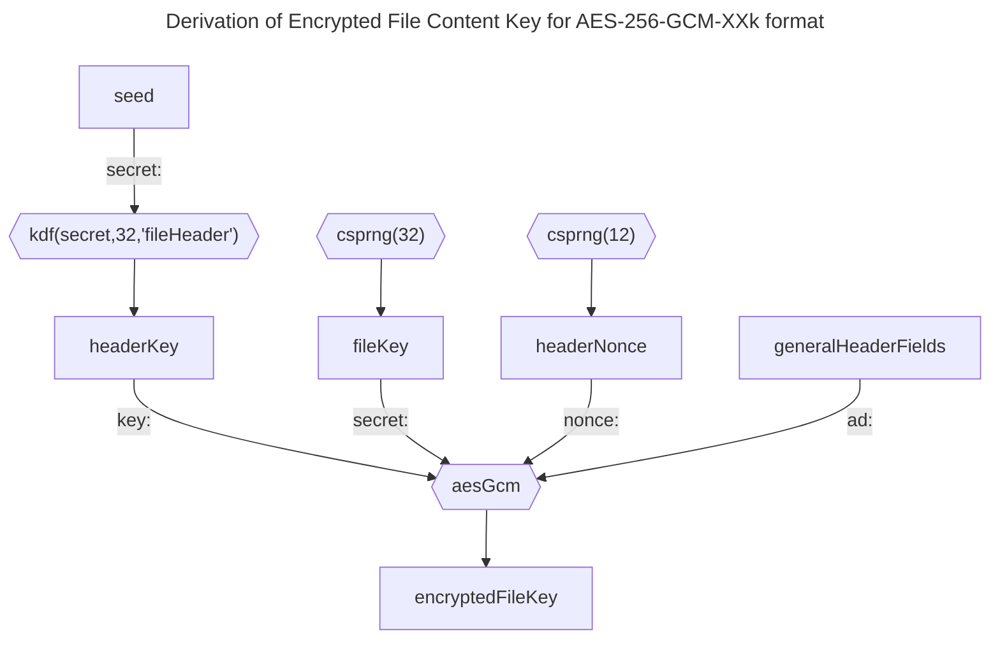
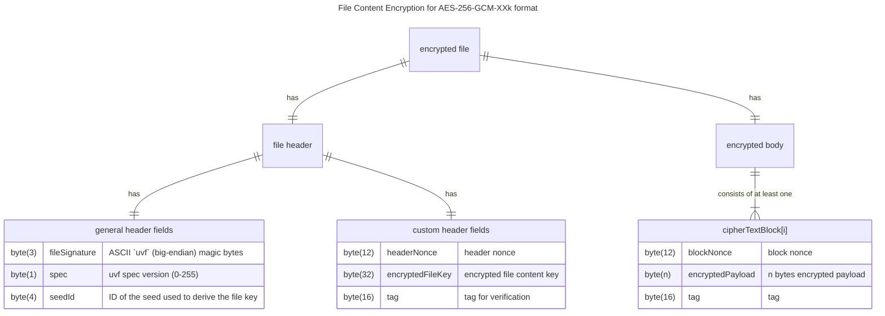

# File Content Encryption using AES-256-GCM

## Format-specific file header fields

Following the [_general header_ fields](README.md), this format requires 60 additional bytes for its _format-specific header_ fields:

* 12 byte nonce
* 32 byte encrypted file content key
* 16 byte tag

The header needs to be encrypted using a 256 bit key derived from the seed using the KDF defined in the [vault metadata file](../vault%20metadata/README.md).

```ts
let headerKey = kdf(secret: latestSeed, length: 32, context: "fileHeader")
let headerNonce = csprng(bytes: 12)
let fileKey = csprng(bytes: 32)
let [encryptedFileKey, tag] = aesGcm(cleartext: fileKey, key: headerKey, nonce: headerNonce, ad: generalHeaderFields)
let header = generalHeaderFields + headerNonce + encryptedFileKey + tag
```



## File Body Encryption

The body is split up into chunks. Each chunk consists of:

* 12 byte nonce
* `n` bytes encrypted payload (see subsections)
* 16 bytes tag

```ts
let blockSize = ...
let cleartextBlocks[] = split(data: cleartext, maxBytes: blockSize)
if (length(cleartext) mod blockSize == 0) {
    // append a zero-byte EOF block iff the last data block is full (or the file is empty)
    cleartextBlocks.append(emptyByteArray)
}
for (let i = 0; i < length(cleartextBlocks); i++) {
    let blockNonce = csprng(bytes: 12)
    let ad = [bigEndian(i), headerNonce]
    let [ciphertextBlock, tag] = aesGcm(cleartext: cleartextBlocks[i], key: fileKey, nonce: blockNonce, ad: ad)
    ciphertextBlocks[i] = blockNonce + ciphertextBlock + tag
}
let body = join(ciphertextBlocks[])
```

### 32k

This variant uses 32740 payload bytes per block (resulting in 32768 encrypted bytes per chunk).
It uses an unsigned 32 bit integer to store the number of blocks `nBlocks` and the current block number `i` (resulting in a maximum cleartext file size of 140,617,229,238,300 bytes or roughly 127 TiB). This limit inherently guarantees the file key to be used for no more than $2^{32}$ nonces, as per  NIST SP 800-38D (Section 8.3).

If the cleartext file size is a multiple of the cleartext block size (0, 32740, 65480, ... bytes), a zero-byte EOF block MUST be appended.

> [!NOTE]
> The exact cleartext size can be derived from the ciphertext size `S` without decrypting the body.
> Strip the 68-byte file header (`body = S - 68`), then split the body into `f = floor(body / 32768)` full chunks and a trailing chunk of `c = body mod 32768` bytes; the cleartext length is `L = 32740 · f + (c - 28)`.
> A well-formed file always satisfies `S >= 96` and `c >= 28`. A trailing chunk of `c == 0` bytes means the EOF block is missing (the file was truncated on a chunk boundary), and `c` in `1..27` is an impossible chunk size — both indicate a truncated or tampered file.
> This is a structural check only and does not authenticate the content; see [File Body Decryption](#file-body-decryption).

## File Body Decryption

Decryption assumes the file header has already been decrypted, yielding `fileKey` and `headerNonce` (see [Format-specific file header fields](#format-specific-file-header-fields)). It realises the decoder validation rule from the [general requirements](README.md#general-requirements): because the block layout is fully determined by the ciphertext size, the structure and the EOF block are validated upfront — before the remaining blocks are decrypted — and every chunk is authenticated against its block number.

```ts
let blockSize = ...                             // 32740 for the 32k variant
let fullChunkSize = 12 + blockSize + 16         // 32768 for the 32k variant

// 1. Derive the block layout from the ciphertext size and reject impossible sizes upfront
let body = fileSize - 68                         // strip the 68-byte file header
let nFullBlocks = floor(body / fullChunkSize)
let lastBlockSize = body mod fullChunkSize
if (body < 28 || lastBlockSize < 28) {
    reject("truncated or corrupted")             // lastBlockSize == 0: EOF block missing; 1..27: impossible chunk size
}
let nBlocks = nFullBlocks + 1                     // total number of chunks, including the trailing block
let hasEofBlock = (lastBlockSize == 28)          // trailing chunk carries a zero-byte payload

// 2. Authenticate the trailing block first: its block number is bound into the ad,
//    so any truncation (including whole removed chunks) is detected here, before the remaining blocks are decrypted
let lastPayload = decryptBlock(index: nBlocks - 1)
if (hasEofBlock && length(lastPayload) != 0) {
    reject("EOF block must be empty")
}

// 3. Decrypt and concatenate the remaining data blocks in order
let cleartext = emptyByteArray
for (let i = 0; i < nBlocks - 1; i++) {
    cleartext = cleartext + decryptBlock(index: i)
}
if (!hasEofBlock) {
    cleartext = cleartext + lastPayload          // trailing block is a partial data block
}
return cleartext

// decryptBlock reads chunk `index`, verifies its authenticity against the block number, and returns the payload
function decryptBlock(index) {
    let [blockNonce, encryptedPayload, tag] = parse(ciphertextBlocks[index])   // 12 | n | 16 bytes
    let ad = [bigEndian(index), headerNonce]
    let payload = aesGcm(ciphertext: encryptedPayload, tag: tag, key: fileKey, nonce: blockNonce, ad: ad)
    if (payload == AUTHENTICATION_FAILURE) {
        reject("block authentication failed")
    }
    return payload
}
```

## Overview



## Security Considerations

These considerations apply in addition to the general [Threat Model and Security Considerations](../security-considerations.md).

* **Primitives.** AES-256-GCM only. The 256-bit keys leave roughly 128-bit security against Grover's algorithm.
* **Nonce budget.** The file key encrypts at most 2^32 blocks (see [32k](#32k)). The header key derived from a seed is shared by every file written under that seed and uses a random 96-bit nonce per file, so NIST SP 800-38D (Section 8.3) also limits a single seed to 2^32 file-header encryptions; applications approaching that count MUST rotate the seed.
* **Length-revealing.** The exact cleartext size is derivable from the ciphertext size without the key (see the note under [32k](#32k)).
