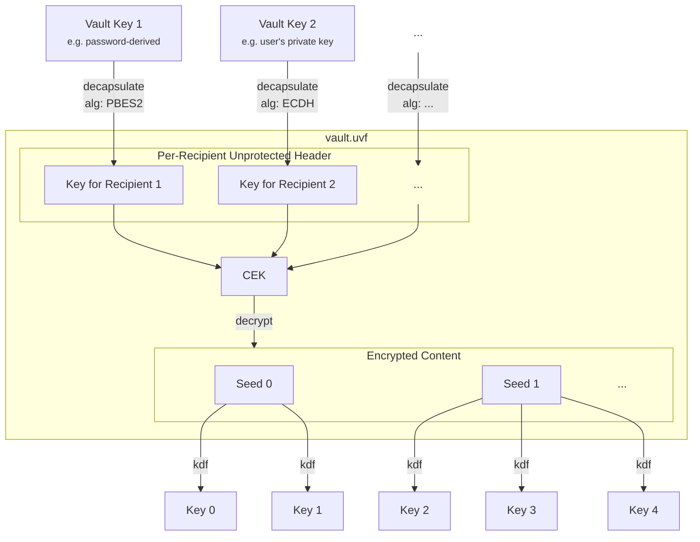

# Vault Metadata

Each vault contains one vault metadata file, which holds essential information like encryption parameters.

> [!NOTE]
> In order to decrypt this file, a _KEK_ is required. Retrieval of this _KEK_ is application-specific and the workflow is not part of this spec. The _KEK_ MAY change any time and MUST change during [key rotation](key-rotation.md).

The vault metadata file is the entry point for vault access, as it contains the material required to derive the keys that all subsequent cryptographic operations depend upon:



## Filename and Location

The metadata file MUST be stored in the root directory of the encrypted vault structure for applications to retrieve it from remote storage without traversing deep hierarchies. Furthermore, it helps the user to understand the purpose of the directory.

The file SHOULD be named `vault.uvf`, however application vendors may decide to use custom names matching their brand or file extensions that are registered with their applications.

## File Format

The file is formatted in _JWE JSON Serialization_ format ([RFC 7516, Section 3.2](https://datatracker.ietf.org/doc/html/rfc7516#section-3.2)), as it is an easy-to-implement, flexible, broadly-used and mature standard that allows to store arbitrary public metadata in its header as well as sensitive data in its ciphertext.

> [!NOTE]
> While the _JWE Compact Serialization_ is more broadly adapted, the JSON serialization is more flexible, allowing multiple distinct vault keys or even vault key types to be used in parallel.

### JOSE Header

With this version of the UVF specification, the following registered header parameters are required:

| Location | Header Parameter | Allowed Values | Remark |
|---|---|---|---|
| Per-Recipient Unprotected Header | `alg` | any | Application-dependent |
| Per-Recipient Unprotected Header | `kid` | any, if prefixed | MUST use application-specific prefix in reverse-DNS notation |
| Protected Header | `enc` | `A256GCM` | Further encryption algorithms may be added in future revisions |
| Protected Header | `cty` | `json` | `application/json` formally correct but `application/` SHOULD be omitted [as per RFC 7515](https://datatracker.ietf.org/doc/html/rfc7515.html#section-4.1.10) |
| Protected Header | `crit` | `["uvf.spec.version"]` | |
| Protected Header | `uvf.spec.version` | `1` | To be increased with newer revisions of this spec |

`zip` MUST be absent (disallowing compression of the plaintext)

If required, further `alg`-specific header parameters MUST be added in the per-recipient unprotected header.

> [!IMPORTANT]  
> Even if only a single recipient exists, it MUST be added to the `recipients` array. Consequently, `alg` and `kid` MUST NOT neither be part of the `protected` nor the `unprotected` header.

> [!NOTE]
> In order to comply with [RFC 7516, Section 4.3](https://datatracker.ietf.org/doc/html/rfc7516#section-4.3), any UVF-specific parameters, such as `uvf.spec.version` MUST be prefixed with `uvf.`.
> 
> Application-specific parameters MUST be prefixed accordingly, e.g. using `com.example.`.

#### Example Protected Header

As the current version of this specification only allows for predefined parameter values, nothing but the parameter order may change. The base64url-encoded version of the protected header should therefore always be this:

```json
"protected": "eyJlbmMiOiJBMjU2R0NNIiwiY3R5IjoianNvbiIsImNyaXQiOlsidXZmLnNwZWMudmVyc2lvbiJdLCJ1dmYuc3BlYy52ZXJzaW9uIjoxfQ"
```

#### Example Per-Recipient Unprotected Header

This is an example for the `recipients` section of the metadata file that contains two alternative methods that the `com.example` application employs in order to decapsulate the CEK.

```json
"recipients": [
    {
        "header": {
            "alg": "PBES2-HS512+A256KW",
            "kid": "com.example.vaultpassword",
            "p2s": "...",
            "p2c": "..."
        },
        "encrypted_key": "..."
    },
    {
        "header": {
            "alg": "ECDH-ES+A256KW",
            "kid": "com.example.userkey.42",
            "epk": {...}
        },
        "encrypted_key": "..."
    }
]
```

> [!TIP]
> Applications that produce a symmetric key in any other way, e.g. using Argon2 may use `"alg": "A256KW"`. It is recommended to document how a key is produced or where it is stored in order to avoid vendor lock-ins.

### Encrypted Content

The JWE Ciphertext decrypts to a JSON object (as denoted by the `cty` header). Any sensitive metadata MUST be added to this.

With this version of the UVF specification, the payload MUST contain at least the following data:

* `fileFormat` (immutable): The exact file format of each [encrypted file](../file%20content%20encryption/README.md)
* `nameFormat` (immutable): The exact format of encrypted [file names](../file%20name%20encryption/README.md)
* `seeds` (append-only): A map of IDs and seeds:
   * the key acting as ID, a sequences of 4 random bytes, encoded in base64url without padding
   * the value is the seed, i.e. the pre-key material, a sequences of 32 bytes generated by a CSPRNG, encoded in base64
* `latestFileKey`: The ID of the seed used to derive a file key for newly added files (changing it allows [key rotation](key-rotation.md))
* `nameKey` (immutable): The ID of the seed used to encrypt file names (will not change during key rotation)
* `kdf` (immutable): A (fast) [KDF](../kdf/README.md) to derive purpose-built subkeys from the seeds. The key length depends on `fileFormat` and `nameFormat`
* `kdfSalt` (immutable): A 32 byte random value for salting the [KDF](../kdf/README.md) which can in turn be used to generate further salts or IVs, avoiding reuse.

> [!IMPORTANT]
> Implementors MUST make sure to leniently parse this JSON object in regards to unknown fields. Further fields MAY be added for vendor-specific use.
> Vendor-specific fields MUST use reverse domain name notation to avoid collisions.
>
> If `fileFormat`, `nameFormat`, or `kdf` values are not defined in the version of this specification denoted by `uvf.spec.version`, it violates the specification, requiring the application to halt processing.

```json
{
    "fileFormat": "AES-256-GCM-32k",
    "nameFormat": "AES-256-SIV",
    "seeds": {
        "HDm38i": "ypeBEsobvcr6wjGzmiPcTaeG7/gUfE5yuYB3ha/uSLs=",
        "gBryKw": "PiPoFgA5WUoziU9lZOGxNIu9egCI1CxKy3PurtWcAJ0=",
        "QBsJFo": "Ln0sA6lQeuJl7PW1NWiFpTOTogKdJBOUmXJloaJa78Y="
    },
    "latestFileKey": "QBsJFo",
    "nameKey": "HDm38i",
    "kdf": "HKDF-SHA512",
    "kdfSalt": "NIlr89R7FhochyP4yuXZmDqCnQ0dBB3UZ2D+6oiIjr8=",
    "org.example.customfield": 42
}
```