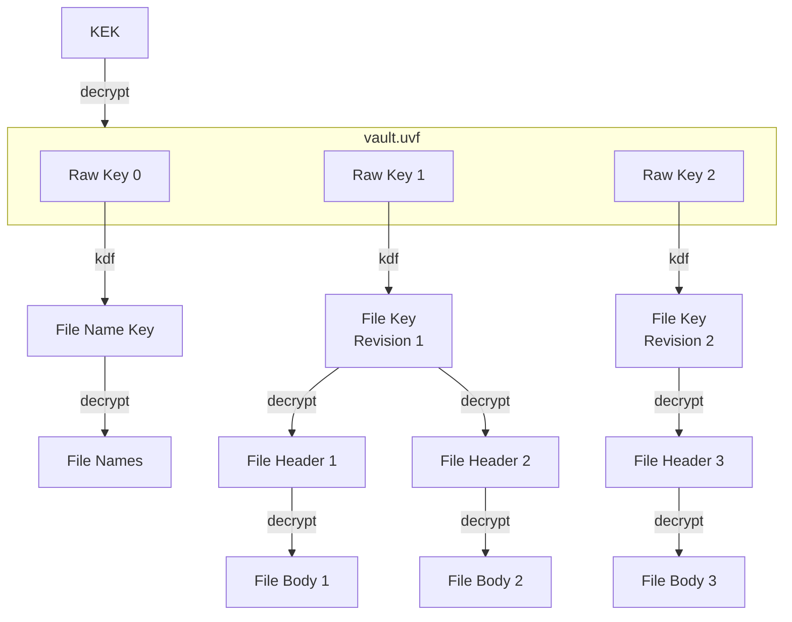

# Vault Metadata

Each vault contains one vault metadata file, which holds essential information like encryption parameters.

> [!NOTE]
> In order to decrypt this file, a _KEK_ is required. Retrieval of this _KEK_ is application-specific and the workflow is not part of this spec. The _KEK_ MAY change any time and MUST change during [key rotation](key-rotation.md).

The vault metadata file is the entry point for vault access, as it contains the keys that all subsequent cryptographic operations depend upon:



## Filename and Location

The metadata file MUST be stored in the root directory of the encrypted vault structure for applications to retrieve it from remote storage without traversing deep hierarchies. Furthermore it helps the user to understand the purpose of the directory.

The file SHOULD be named `vault.uvf` (_TBD_), however application vendors may decide to use custom names matching their brand.

## File Format

The file contains a JWE in _JWE Compact Serialization_ format ([RFC 7516](https://datatracker.ietf.org/doc/html/rfc7516)), as it is an easy-to-implement, flexible, broadly-used and mature standard that allows to store arbitrary public metadata in its header as well as sensitive data in its ciphertext.

### Public Metadata

In order to comply with [RFC 7516, Section 4.2](https://datatracker.ietf.org/doc/html/rfc7516#section-4.2), any UVF-specific parameters MUST be prefixed with `uvf.`.

With this version of the UVF specification, the following registered header fields and values are supported:

| JOSE Header | Allowed Values | Remark |
|---|---|---|
| `alg` | `A256KW` | Further algorithms may be added in later revisions |
| `enc` | `A256GCM` | Further encryption algorithms may be added in later revisions |
| `typ` | `JWE` | |
| `cty` | `json`, (`application/json`) | `application/` SHOULD be omitted [as per spec](https://datatracker.ietf.org/doc/html/rfc7515.html#section-4.1.10) |
| `crit` | `["uvf.spec.version"]` | |
| `uvf.spec.version` | `1` | To be increased with newer revisions of this spec |

`zip` MUST be omitted (disallowing compression of the plaintext)

### Sensitive Metadata

The JWE Ciphertext decrypts to a JSON object (as denoted by the `cty` header). Any sensitive metadata MUST be added to this.

With this version of the UVF specification, the payload MUST contain at least the following data:

* `fileFormat` (immutable): The exact file format of each [encrypted file](../file%20content%20encryption/README.md)
* `nameFormat` (immutable): The exact format of encrypted [file names](../file%20name%20encryption/README.md)
* `keys` (append-only): A map of _Key IDs_ and serialized raw keys
* `latestFileKey`: The _Key ID_ of the raw key used to derive a file key for newly added files (changing it allows [key rotation](key-rotation.md))
* `nameKey` (immutable): The _Key ID_ of the raw key used to encrypt file names (will not change during key rotation)
* `kdf` (immutable): A (fast) KDF to derive purpose-built keys from the raw keys. The key length depends on `fileFormat` and `nameFormat`

> [!IMPORTANT]
> Implementors MUST make sure to leniently parse this JSON object in regards to unknown fields. Further fields MAY be added for vendor-specific use.
> Vendor-specific fields MUST use reverse domain name notation to avoid collisions.

```json
{
    "fileFormat": "AES-256-GCM-32k",
    "nameFormat": "AES-256-SIV",
    "keys": {
        "HDm3": "ypeBEsobvcr6wjGzmiPcTaeG7/gUfE5yuYB3ha/uSLs=",
        "cnQp": "PiPoFgA5WUoziU9lZOGxNIu9egCI1CxKy3PurtWcAJ0=",
        "QBsJ": "Ln0sA6lQeuJl7PW1NWiFpTOTogKdJBOUmXJloaJa78Y="
    },
    "latestFileKey": "QBsJ",
    "nameKey": "HDm3",
    "kdf": "TODO",
    "org.example.customfield": 42
}
```

### Example / Test Data

TODO: add example JWE and KEK